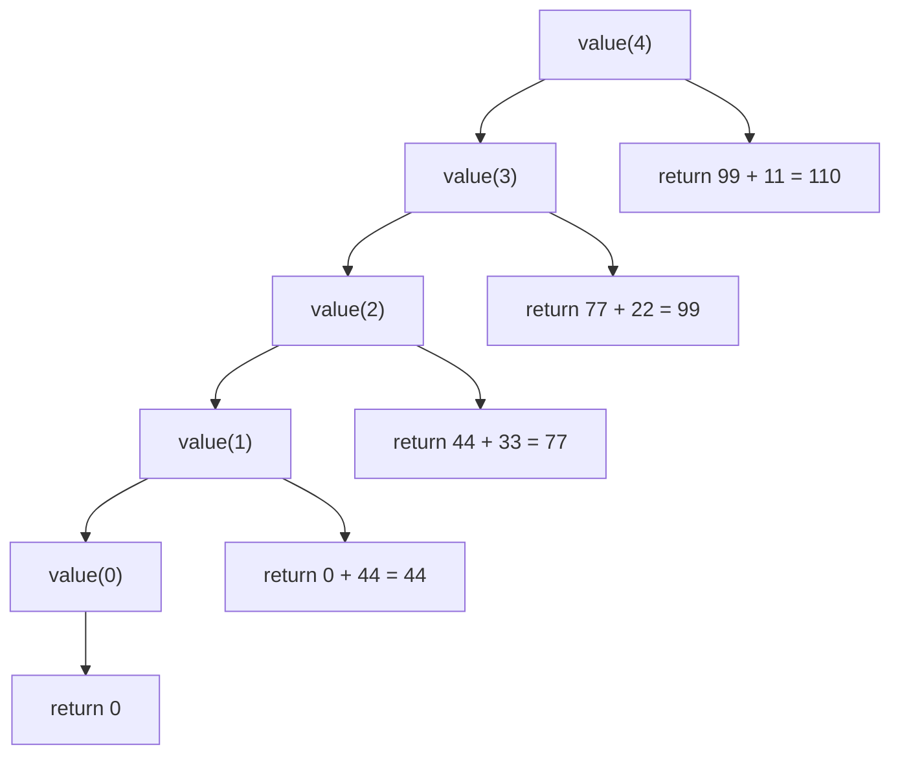
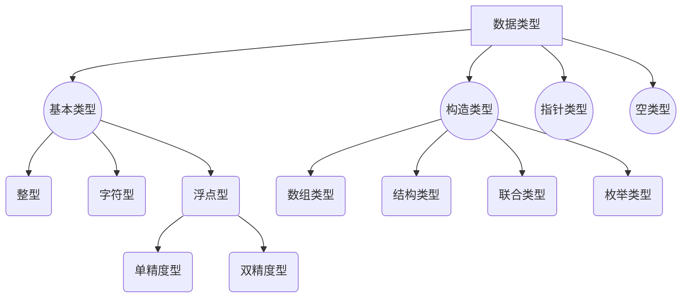

# 简答题

## 2024

### 数组和结构的区别与联系

**区别**：

1. **元素类型**：数组中的元素必须是同一类型；结构体中的成员可以是不同类型。
2. **内存分配**：数组元素在内存中连续存储；结构体成员的内存布局可能因对齐规则存在间隙。
3. **访问方式**：数组通过下标访问元素（如 `arr[0]`）；结构体通过成员名访问（如 `s.member`）。
4. **赋值操作**：数组不能直接整体赋值（需逐元素操作）；结构体可以直接整体赋值（C99后支持）。

**联系**：

1. **复合数据类型**：二者均用于组织多个数据，可嵌套使用（如结构体包含数组，或数组元素为结构体）。
2. **内存连续性**：结构体的成员在内存中按声明顺序存储，类似数组的连续性（但可能存在对齐填充）。

### 判断含义

```c
int *p[];

int (*p)[];

int *p();

int (*p)();
```

1. **`int *p[];`**
   - **含义**：`p` 是一个数组，元素类型为 `int*`（指针数组）。
   - 例如：`int *p[5]` 表示长度为5的数组，每个元素指向 `int`。

2. **`int (*p)[];`**
   - **含义**：`p` 是一个指针，指向一个 `int` 类型的数组（数组指针）。
   - 例如：`int (*p)[3]` 表示 `p` 指向长度为3的 `int` 数组。

3. **`int *p();`**
   - **含义**：`p` 是一个函数，返回值类型为 `int*`（函数返回指针）。
   - 例如：`int *p()` 定义了一个返回 `int` 指针的函数。

4. **`int (*p)();`**
   - **含义**：`p` 是一个指针，指向一个返回 `int` 的函数（函数指针）。
   - 例如：`int (*p)(int)` 表示 `p` 指向接受一个 `int` 参数并返回 `int` 的函数。

### 改错题

```c
#include <stdio.h>
#include <stdlib.h>
#include <string.h>

void main()
{
    char *src = "hello,world";
    char *dest, *d, *p;
    int len, i;

    len = strlen(src); // strlen 返回的是真实字符串长度，不包含 '\0'
    dest = (char*)malloc(len); // 修正：分配足够的内存 -> len + 1 以容纳字符串结尾的 '\0'
    p = src[len]; // 修正：使 p 指向 src 的最后一个字符 -> len - 1
    d = dest;

    while (len-- != 0)
        d++ = p--; // 修正：正确地将 src 的字符逆序复制到 dest -> *(d++) = *(p--)

    // 补充：添加字符串结尾必须的 '\0' -> *d = '\0';
    printf("%s", dest);
}
```

### 静态变量和全局变量的区别；静态变量和普通局部变量的区别

#### 静态变量与全局变量

1. **作用域**：
   - 全局变量：整个程序可见（默认具有外部链接，可用 `extern` 跨文件访问）。
   - 静态全局变量：仅在定义它的文件内可见（内部链接）。
2. **初始化**：二者均默认初始化为0（若未显式初始化）。

#### 静态变量与普通局部变量

1. **生命周期**：
   - 静态局部变量：程序运行期间始终存在（仅初始化一次）。
   - 普通局部变量：函数调用时创建，退出时销毁。
2. **存储位置**：
   - 静态变量（包括全局和静态局部）存储在静态存储区（`.data` 或 `.bss`）。
   - 普通局部变量存储在栈区。
3. **初始化**：
   - 静态局部变量默认初始化为0；普通局部变量不初始化时值为随机值。

---

## 2023

### 1. C 语言执行效率措施⭐⭐⭐（之前年年考）

> 从 C 语言执行效率方便，简述下 C 语言采取了哪些措施提高执行效率。

C 语言通过以下措施提高执行效率：

1. **编译型语言**：直接编译为机器码，减少解释执行的中间开销。
2. **静态类型检查**：编译时确定类型，避免运行时类型判断。
3. **指针和直接内存操作**：允许直接操作内存地址，减少数据拷贝。
4. **底层控制**：支持寄存器变量、内联函数等优化，减少函数调用开销。
5. **内存对齐**：通过结构体对齐优化内存访问速度。
6. **高效循环和条件语句**：提供灵活的循环和跳转控制（如 `goto`），减少冗余操作。

具体优化方法：

- **使用指针**：类似于汇编中的寻址方式，直接访问硬件，提高程序效率。
- **使用宏函数**：避免函数调用的压栈和弹栈操作，节省 CPU 时间，提高运行效率。
- **使用位操作**：减少除法和取模运算，灵活控制硬件和数据变换，提高效率。
- **优化循环嵌套**：将较长循环设为内层循环，较短循环设为外层循环，减少 CPU 跨切循环层次数。
- **使用 API**：调用系统 API，使代码运行更接近底层。
- **使用寄存器变量**：利用寄存器的高存取速度，提升程序性能。
- **嵌入汇编语言**：让代码运行效率接近极限。

### 2. 内存分配分析(2015考过)

> 根据下面的代码，填写表格。整数算 2 字节，字符 2 字节，指针 4 字节。每个区域的起始地址都是 0，内存按 2 字节编址。

```c
int num = 2;

void main()
{
    char str1[2018] = {"UESTC"}; // 不记得这里几个字符了，反正就是要乘 2
    char* str2 = "CHENGDU";
    char p;
}

void func(int m)
{
    static int sta;
    int n = 10;
}
```

| 内存区域     | 常量或变量名       | 占用内存大小 |
|--------------|--------------------|--------------|
| 常量区       | `"CHENGDU"`        | 16 字节      |
| 常量区       | `"UESTC"`          | 12 字节      |
| 全局区       | `num`              | 2 字节       |
| 静态数据区   | `sta`（`func`中的静态变量） | 2 字节       |
| main 函数    | `str1[2018]`       | 4036 字节    |
| main 函数    | `str2`（指针）     | 4 字节       |
| main 函数    | `p`                | 2 字节       |
| func 函数    | `n`                | 2 字节       |
| func 函数    | `m`                | 2 字节       |

#### **内存区域划分说明**

- **常量区**：存储字符串字面量（如 `"CHENGDU"`、`"UESTC"`）等只读数据。
- **全局区**：存储全局变量（如 `num`）。
- **静态数据区**：存储静态变量（如 `sta`）。
- **栈区**：存储函数内的局部变量、参数和指针（如 `str1`、`str2`、`p`、`n`、`m`）。

#### **变量与常量的具体分配**

##### **1. 常量区**

| 变量/常量         | 大小计算                     | 占用内存大小 |
|-------------------|-----------------------------|--------------|
| `"CHENGDU"`       | 字符串长度：7字符 + `\0` = 8字符 × 2字节/字符 | **16 字节**  |
| `"UESTC"`         | 字符串长度：5字符 + `\0` = 6字符 × 2字节/字符 | **12 字节**  |

**说明**：

- 字符串字面量存储在只读的常量区。
- `str1` 数组的初始化值 `"UESTC"` 会从常量区拷贝到栈区，但原字符串仍存在于常量区。

##### **2. 全局区**

| 变量              | 类型         | 大小计算          | 占用内存大小 |
|-------------------|-------------|-------------------|--------------|
| `num`             | `int`       | `sizeof(int) = 2` | **2 字节**   |

**说明**：

- 全局变量 `num` 在程序启动时分配内存，生命周期持续到程序结束。

##### **3. 静态数据区**

| 变量              | 类型         | 大小计算          | 占用内存大小 |
|-------------------|-------------|-------------------|--------------|
| `sta`（静态变量） | `static int`| `sizeof(int) = 2` | **2 字节**   |

**说明**：

- `sta` 是 `func` 函数内的静态变量，存储在静态数据区，与函数调用无关，生命周期同全局变量。

##### **4. 栈区（`main` 函数）**

| 变量              | 类型           | 大小计算                     | 占用内存大小 |
|-------------------|---------------|-----------------------------|--------------|
| `str1[2018]`      | `char[]`      | `2018元素 × 2字节/字符`      | **4036 字节**|
| `str2`（指针）    | `char*`       | `sizeof(指针) = 4`          | **4 字节**   |
| `p`               | `char`        | `sizeof(char) = 2`          | **2 字节**   |

**说明**：

- `str1` 是局部数组，在 `main` 函数栈中分配，初始化时从常量区***拷贝*** `"UESTC"` 并填充剩余空间为 `0`。
- `str2` 是指针变量，指向常量区的 `"CHENGDU"`，自身占 4 字节（指针大小）。

##### **5. 栈区（`func` 函数）**

| 变量              | 类型         | 大小计算          | 占用内存大小 |
|-------------------|-------------|-------------------|--------------|
| `n`               | `int`       | `sizeof(int) = 2` | **2 字节**   |
| `m`（参数）       | `int`       | `sizeof(int) = 2` | **2 字节**   |

**说明**：

- `n` 是局部变量，`m` 是函数参数，均在 `func` 被调用时在栈区分配内存，函数返回后释放。

#### **关键错误修正**

- **数值字面量（如 `10`、`2018`、`2`）不存储在常量区**，而是直接嵌入代码或通过变量存储。
  - 例如：`2018` 是数组大小信息，存在于编译后的符号表中，不单独占用内存；`num=2` 的 `2` 存储在全局变量 `num` 的内存中。

### 3. 循环结构分析

> `For(int i=0; nums[i] != temp; i++){printf("%d", i);}` 是什么结构? 使用显示结构语言该如何表示? 并标出条件跳转和强制跳转。

1. **结构类型**：条件分支结构（选择结构）。
2. **显示结构语言表示**：

   ```plaintext
   i = 0
   条件跳转（循环入口）：
     若 nums[i] == temp → 强制跳转到循环结束
     否则执行循环体：
         printf("%d", i)
         i++
         强制跳转回循环入口
   循环结束
   ```

3. **跳转标注**：
   - **条件跳转**：检查 `nums[i] != temp`，若条件不满足则跳出循环。
   - **强制跳转**：循环体执行后无条件跳转回循环入口。

### 4. 数组查找问题

在一个 array 数组里面找 item 变量

```c
scanf("%d", &item);
for (int numb = 0; array[numb] != item; numb++);
printf("%d", numb);
```

---

## 2019

### 请问用C语言编程实现网络数据传输，应该使用TCP/IP协议还是HTTP协议，为什么？

应使用**TCP/IP协议**。
**原因**：

- **协议层次**：TCP/IP是传输层协议，负责可靠的数据传输；HTTP是应用层协议，基于TCP/IP实现。
- **编程实现**：C语言通过套接字（Socket）直接操作传输层（TCP或UDP），而HTTP需要解析应用层协议格式，开发复杂度更高。
- **灵活性**：TCP/IP提供字节流传输，可自定义协议；HTTP固定了报文格式，适用于Web场景。

### 详细叙述一下一款客户定制的软件应该怎么进行测试，并交付使用

**测试步骤**：

1. **需求分析**：明确客户需求，制定测试计划。
2. **测试设计**：编写测试用例（功能、性能、安全等），覆盖所有需求。
3. **环境搭建**：部署与客户环境一致的测试平台。
4. **单元测试**：验证模块功能，使用白盒测试。
5. **集成测试**：检查模块间接口和数据流。
6. **系统测试**：整体验证功能、性能、兼容性等。
7. **用户验收测试（UAT）**：客户参与，确认软件符合预期。

**交付流程**：

1. **文档交付**：提供用户手册、技术文档、测试报告。
2. **培训支持**：指导客户使用及维护。
3. **维护服务**：修复后续发现的缺陷，提供升级支持。

---

## 2018

### 请简述C语言的隐式类型转换发生的四种情况，并说明每种情况如何转换。（注：这里面还有个小题，float如何四舍五入转化成long类型）

1. **算术运算中的类型提升**：
   - 操作数类型不同时，低精度类型转为高精度类型（如`int`转`float`）。
2. **赋值时的类型转换**：
   - 右侧值类型自动转为左侧变量类型（如`float`赋值给`int`会截断小数）。
3. **函数调用传参**：
   - 实参类型与形参不匹配时，实参转为形参类型（如传递`int`给`float`形参）。
4. **返回值类型转换**：
   - 返回值类型与函数声明不一致时，自动转换（如返回`double`但声明为`int`）。

**float转long的四舍五入**：
C语言默认截断小数（向零取整），需手动实现四舍五入：

```c
long rounded = (long)(float_num + 0.5f);  // 正数适用，负数需额外处理
```

### 从C语言执行效率方便，简述下C语言除了指针、宏函数、位运算还采取了哪些措施提高执行效率

- **编译器优化**：启用`-O3`优化选项。
- **寄存器变量**：使用`register`关键字减少内存访问。
- **内联函数**：避免函数调用开销（`inline`）。
- **循环优化**：展开循环、减少分支预测失败。
- **内存对齐**：通过`#pragma pack`提升访问速度。
- **静态库链接**：减少动态链接开销。

### 数组越界会产生什么后果？

- **数据覆盖**：越界写入可能破坏其他变量或栈帧（导致程序崩溃）。
- **安全漏洞**：缓冲区溢出可能被利用执行恶意代码。
- **未定义行为**：结果不可预测，可能正常执行、崩溃或产生随机错误。

### 实参和形参都是数组元素；实参是数组地址，形参是指针；实参和形参都是数组地址问这三个都是什么传递方式

1. **实参和形参都是数组元素**：
   - **值传递**（传递单个元素的值）。
2. **实参是数组地址，形参是指针**：
   - **地址传递**（指针接收数组首地址）。
3. **实参和形参都是数组地址**：
   - **地址传递**（数组名退化为指针，传递首地址）。

---

## 2017

### 控制结构与伪代码表示

`if(B) s1 else s2; 的显式结构语言表示`

**选择结构**

```pseudo
Begin
    If b != 0
        条件跳转
        Do S1;
    否则
        Do S2;
End
```

**显式结构表示：**

```pseudo
if(b) goto L1;
s2;
goto L2;
L1: s1;
L2:;
```

`do s while(B); 的显式控制结构`

**循环结构**

#### 版本 1（汇编写法）

```pseudo
L: s;
cmp B, 0
jnz L;
```

#### 版本 2（伪代码写法）

```pseudo
label: s;
If(B)
    goto label;
```

`switch 结构的显式控制结构`

对于以下 C 代码：

```c
switch (E) {
  case N1:
    S1;
    break;
  case N2:
    S2;
    break;
  default:
    S3;
}
```

**伪代码形式：**

```pseudo
if (E == N1) {
    goto LABEL_N1;
} else if (E == N2) {
    goto LABEL_N2;
} else {
    goto LABEL_DEFAULT;
}

LABEL_N1:
    S1;
    goto END_SWITCH;

LABEL_N2:
    S2;
    goto END_SWITCH;

LABEL_DEFAULT:
    S3;

END_SWITCH:
```

---

### C语言的关键字与其他单词类型

- **C语言单词类型：**
  - 标识符
  - 运算符
  - 分隔符
  - 常量
  - 注释符

- **C语言存储类型关键字：**
  - `auto`
  - `extern`
  - `register`
  - `static`

## 2016

### 程序效率分析

```c
// 独立的 if 语句                 | // 嵌套的 else if 语句
if (B1) {                        | if (B1) {
    S1;                          |     S1;
}                                | } else if (B2) {
if (B2) {                        |     S2;
    S2;                          | } else if (B3) {
}                                |     S3;
if (B3) {                        | } else {
    S3;                          |     // 默认分支
}                                | }
```

**效率分析：**

1. **独立 if 语句：**
   - 每个条件判断都会被单独执行，无论前面的条件是否满足。
   - 时间复杂度为 O(n)，其中 n 是条件的数量。

2. **嵌套 else if 语句：**
   - 条件判断按顺序执行，一旦某个条件满足，后续条件将不再检查。
   - 时间复杂度在最坏情况下为 O(n)，但在平均情况下可能优于独立 if 语句。

**结论：**

- 如果条件之间存在互斥性（即最多只有一个条件成立），使用嵌套的 `else if` 更高效。
- 如果每个条件都需要独立判断，则使用独立的 `if` 语句更合适。

---

### 宏定义输出分析

```c
#define SQUARE(x) ((x)*(x));
int a = 5, b;
b = SQUARE(a++);
```

**展开后：**

```c
b = ((a++) * (a++));
```

**计算过程：**

1. 初始值 `a = 5`。
2. 第一个 `a++` 取值为 5，`a` 自增为 6。
3. 第二个 `a++` 取值为 6，`a` 自增为 7。
4. 计算结果：`b = 5 * 6 = 30`。

**最终结果：**

- `a = 7`
- `b = 30`

---

### 函数中使用同名全局变量

在 C++ 中，可以通过作用域区分符 `::` 引用全局变量。例如：

```cpp
#include <iostream>
using namespace std;

int global_x = 10; // 全局变量

void func() {
    int global_x = 20; // 局部变量
    cout << "局部变量：" << global_x << endl; // 输出 20
    cout << "全局变量：" << ::global_x << endl; // 输出 10
}

int main() {
    func();
    return 0;
}
```

**说明：**

- `::global_x` 表示引用全局作用域中的 `global_x`。
- 如果没有冲突，直接使用变量名即可访问全局变量。

---

## 2015

### 循环语句 for(int i=1;i<n;i++) S；请问是什么结构，请用显式结构语言表示该程

**答案：循环判断选择结构**

**显式结构语言表示：**

```plaintext
i = 1
S_for:
if i < n goto S_do
goto S_exit
S_do:
S
i = i + 1
goto S_for
S_exit:
```

或者另一种等价表示：

```plaintext
Lable1:
if (i < n) goto S;
if (i == n) goto S1;
S:
执行程序；
i++;
goto Lable;
S1:
结束
```

---

### 分析内存大小

> 整数算 2 字节，字符 1 字节，指针 4 字节。每个区域的起始地址都是 0，内存按 2 字节编址

**代码分析：**

```c
int num = 2;
void main() {
  char str1[10] = {"UESTC"};
  char *str2 = "CHENGDU";
  char p;
}
void func(int m) { int n = 10; }
```

**表格输出：**

#### 常量区

| 内存区域   | 常量或变量名 | 占用内存大小 | 内存相对地址 |
| ---------- | ------------ | ------------ | ------------ |
|    常量区   | `"UESTC"`    | 6            | 2            |
|            | `"CHENGDU"`  | 8            | 5            |
| 全局       | `num`        | 2            | 0            |
| `main`函数 | `str1`       | 10           | 0            |
|            | `str2`       | 4            | 5            |
|            | `p`          | 1            | 7            |
| `func`函数 | `m`          | 2            | 0            |
|            | `n`          | 2            | 1            |

1. `char str1[10]={"UESTC"};` "UESTC"算字符串常量，但是 str1 对应的内存要占用 10 字节。

2. `void func(int m)` 形参也是要占用内存的，在函数被调用时申请内存，在函数结束时撤销。

---

## 2014

### C语言中常量存储在哪里？static 全局变量和普通的全局变量有什么区别？他们又分别存储在哪里？

**答案：**

1. **常量存储位置：**
   - 常量（如字符串字面量、整型常量）通常存储在**常量区**，这是程序的只读数据段。
   - 例如：`"CHENGDU"` 和 `2` 存储在常量区。

2. **static 全局变量与普通全局变量的区别：**
   - **普通全局变量：**
     - 存储在**全局/静态存储区**。
     - 可以被其他文件访问（通过 `extern` 声明）。
   - **static 全局变量：**
     - 同样存储在**全局/静态存储区**。
     - 但作用域仅限于定义它的文件，不能被其他文件访问。

---

### 模拟加写原因

**问题描述：**

设 `arr` 为整型数组，`num` 和 `item` 为整型变量，`N = 数组元素个数 - 1`。需要查找 `item` 是否在数组中，如果程序片段为：

```c
for(num = N; arr[num] != item; num--);
printf("%d", num);
```

**可能导致的异常结果及原因：**

1. **异常结果：**
   - 如果 `item` 不在数组中，`num` 会递减到负值，导致数组越界访问，可能引发程序崩溃或未定义行为。

2. **原因：**
   - 循环条件 `arr[num] != item` 在 `item` 不在数组中时始终为真，导致 `num` 不断递减。
   - 当 `num` 小于 0 时，`arr[num]` 访问无效地址。

3. **解决方法：**
   - 添加边界检查，确保 `num >= 0`：

     ```c
     for(num = N; num >= 0 && arr[num] != item; num--);
     printf("%d", num);
     ```

---

### 递归函数辨析

**问题描述：**

设有递归函数：

```c
int value(int n) {
  int x;
  if (n == 0)
    return 0;
  else {
    scanf("%d", &x);
    return (value(n - 1) + x);
  }
}
```

如该函数被调用时，参数 `n` 值为 4，输入的 `x` 的值依次为 11，22，33，44，函数调用结束时返回值是多少？并用图描述函数递归执行过程。

**答案：**

1. **返回值计算：**
   - 函数递归调用时，每次读取一个 `x` 值，并将其累加到递归返回的结果中。
   - 输入顺序为 `11, 22, 33, 44`，最终返回值为：

     ```
     11 + 22 + 33 + 44 = 110
     ```

2. **递归执行过程图：**



---

### 数据类型

**数据类型的分类：**


